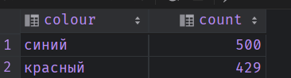
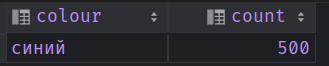
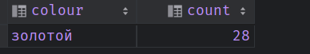

/*
Телефоны какого цвета чаще всего покупают?
Ответ. Синий
 */
*/
select colour, count(table_checkout.id) as 'count'
from table_checkout
inner join table_phones tp on table_checkout.phone_id = tp.id
GROUP BY colour
ORDER BY count DESC
LIMIT 1

/*
Какие телефоны чаще покупают: красные или синие?
Ответ: синие
*/

/*Какой самый непопулярный цвет телефона?
  Ответ. Золотой
  */
select colour, count(table_checkout.id) as 'count'
from table_checkout
inner join table_phones tp on table_checkout.phone_id = tp.id
GROUP BY colour
ORDER BY count
LIMIT 1
