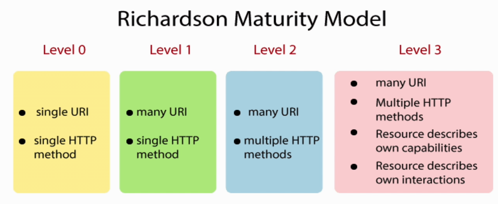

Судя по этой схеме в коллекции присутствует несколько запросов. В частности GET и POST. Значит уровень 1 и 2 не подходят, а чтобы подходил уровень 3, то нужно еще дополнительный информативный массив links, где указаны связанные api с конкретным запросом.   
Значит в данном примере реализован 2 уровень, но не до конца, так как не реализованы еще delete и put методы.   
Запрос get-room возвращает все комнаты, но по идее должен возвращать конкретную комнату.   
Запрос booking имеет метод Get, но меняет состояние и плюс к этому не является идемпотентным. Поэтому нужно его переименовать в POST.
